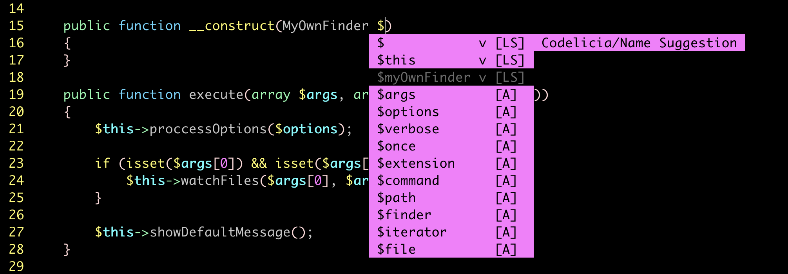

Codelicia — Phpactor Name Suggestion
====================================

<p align="center">
  
</p>
It will give suggestions for parameter names when creating methods.

Using the Language Server Protocol
----------------------------------

Phpactor implements the Language Server Protocol which is supported by many text editors and IDEs.

First perform a [Phpactor Global Installation](https://phpactor.readthedocs.io/en/master/usage/standalone.html#installation-global) and then [configure the language server](https://phpactor.readthedocs.io/en/master/usage/language-server.html#language-server) in your editor.

You can now in the phpactor-name-suggestion extension via CLI:

```
phpactor extension:install codelicia/phpactor-name-suggestion
```

To check it the extension is running run:
```
phpactor extension:list
```

Using the VIM RPC Plugin
------------------------

Install the [VIM RPC Plugin](https://phpactor.readthedocs.io/en/master/usage/vim-plugin.html).

You can run `:call phpactor#ExtensionInstall('codelicia/phpactor-name-suggestion')`
to install the phpactor-name-suggestion extension.

If everything goes right, you can see the following message
`Extension "codelicia/phpactor-name-suggestion" installed`.

One can also check the installed extensions by running
`call phpactor#ExtensionList()`
